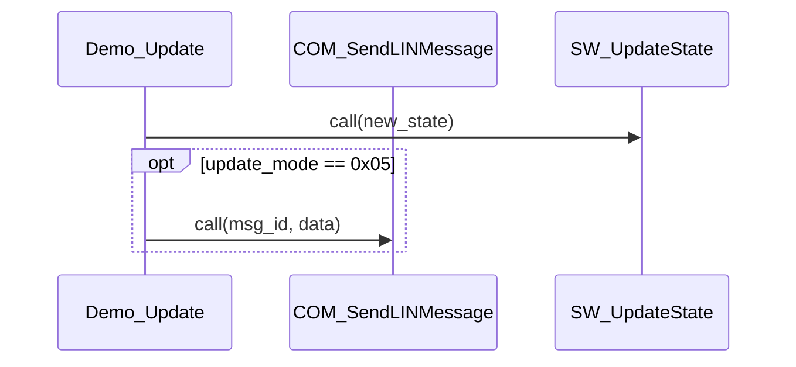

# AGENTS.md - Project Context Document

This document provides comprehensive project context for AI agents (Claude Code, iFlow CLI, etc.) to guide future code interactions and development work.

---

## Project Overview

**AUTOSAR Call Tree Analyzer** is a professional Python tool for static analysis of C/AUTOSAR codebases to generate function call trees. Designed for automotive embedded systems development, it can parse AUTOSAR proprietary macros (such as `FUNC`, `VAR`, `P2VAR`, etc.) and output sequence diagrams in multiple formats.

**Core Capabilities**:
- ✨ Complete AUTOSAR macro support (`FUNC`, `FUNC_P2VAR`, `FUNC_P2CONST`, `VAR`, `P2VAR`, `P2CONST`, etc.)
- 🔍 Static analysis without compilation
- 📊 Multiple output formats:
  - **Mermaid sequence diagrams** (Markdown)
  - **XMI/UML 2.5** (importable to Enterprise Architect, Visual Paradigm, MagicDraw)
  - JSON (planned)
- 🏗️ SW module support: Map C files to SW modules via YAML configuration for architecture-level diagrams
- 📈 Module-aware diagrams: Use SW module names as participants
- 🎯 Parameter display: Show function parameters in sequence diagram calls
- 🔄 **Automatic conditional detection**: Automatically detects `if`/`else` statements and generates `opt` blocks with actual conditions
- 🚀 High performance: Intelligent caching for fast repeated analysis with file-by-file progress reporting
- 🎯 Depth control: Configurable call tree depth
- 🔄 Circular dependency detection: Identify recursive calls and cycles
- 📊 Detailed statistics: Analysis statistics including module distribution
- 📝 Clean diagrams: Return statements omitted by default for cleaner sequence diagrams (configurable)
- ⚡ Optimized large file handling: Use line-by-line matching to avoid catastrophic backtracking, supporting 10,000+ line files

---

## Tech Stack

- **Language**: Python 3.8+
- **Main Dependencies**:
  - `click>=8.0.0` - Command-line interface
  - `rich>=10.0.0` - Rich text terminal output
  - `pydantic>=2.0.0` - Data validation
  - `jinja2>=3.0.0` - Template engine
  - `pyyaml>=6.0` - YAML configuration parsing
- **Development Tools**:
  - `pytest>=7.0.0` - Testing framework
  - `pytest-cov>=3.0.0` - Test coverage
  - `black==24.8.0` - Code formatting
  - `ruff>=0.0.0` - Fast Linter
  - `flake8>=4.0.0` - Code linting
  - `mypy>=0.950` - Type checking
  - `isort>=5.10.0` - Import sorting

---

## Project Structure

```
autosar_calltree/
├── src/autosar_calltree/
│   ├── cli/              # Command-line interface
│   │   └── main.py       # Click-based CLI entry point
│   ├── config/           # Configuration management (module mappings)
│   │   └── module_config.py  # YAML configuration loading and validation
│   ├── parsers/          # Code parsers
│   │   ├── autosar_parser.py  # AUTOSAR macro parsing
│   │   └── c_parser.py   # Traditional C function parsing (performance optimized)
│   ├── analyzers/        # Analysis logic
│   │   └── call_tree_builder.py  # Call tree builder
│   ├── database/         # Data models and caching
│   │   ├── function_database.py  # Function database
│   │   └── models.py     # Core data classes
│   ├── generators/       # Output generators
│   │   ├── mermaid_generator.py  # Mermaid sequence diagram generator
│   │   └── xmi_generator.py      # XMI/UML 2.5 generator
│   ├── utils/            # Utility functions (empty, for future use)
│   └── version.py        # Version information
├── demo/                 # Demo AUTOSAR C files
│   ├── demo.c
│   ├── hardware.c
│   ├── software.c
│   ├── communication.c
│   ├── CanTp_Cfg.c       # Large configuration file (13,334 lines, 95KB)
│   ├── module_mapping.yaml
│   ├── demo.md           # Mermaid output example
│   └── demo_main.xmi     # XMI output example
├── tests/                # Test suite
│   ├── fixtures/         # Test data
│   ├── integration/      # Integration tests
│   └── unit/             # Unit tests
├── docs/                 # Documentation
│   ├── requirements/     # Software requirements
│   ├── tests/            # Test index
│   ├── plans/            # Development plans
│   └── TRACEABILITY.md   # Requirements traceability matrix
├── scripts/              # Utility scripts
│   ├── run_tests.sh      # Run tests
│   ├── run_quality.sh    # Run quality checks
│   ├── check_traceability.py  # Check requirements traceability
│   └── generate_large_demo.py # Generate large demo files
├── pyproject.toml        # Project configuration
├── requirements.txt      # Production dependencies
├── requirements-dev.txt  # Development dependencies
└── README.md             # Project documentation
```

---

## Building and Running

### Installation

```bash
# Production installation
pip install autosar-calltree

# Development mode installation (with dev dependencies)
pip install -e ".[dev]"
```

### Running Tests

```bash
# Run all tests
pytest

# Run specific test module
pytest tests/unit/test_models.py
pytest tests/unit/test_parsers.py
pytest tests/unit/test_database.py
pytest tests/unit/test_analyzers.py
pytest tests/unit/test_config.py
pytest tests/unit/test_generators.py
pytest tests/integration/test_cli.py

# Run specific test case
pytest tests/unit/test_models.py::TestFunctionType::test_function_type_enum_values

# Verbose output with live stdout
pytest -vv -s tests/

# Generate coverage report (HTML + terminal)
pytest --cov=autosar_calltree --cov-report=html --cov-report=term

# Use convenience script
./scripts/run_tests.sh
```

### Code Quality Checks

```bash
# Format code
black src tests
isort src tests

# Check formatting
black --check src tests
isort --check-only src tests

# Linting
flake8 src tests

# Type checking
mypy src/

# Run all quality checks with convenience script
./scripts/run_quality.sh
```

### CLI Usage

```bash
# Basic analysis (uses default source directory ./demo)
calltree --start-function Demo_Init --source-dir ./demo

# Use SW module configuration for architecture-level diagrams
calltree --start-function Demo_Init --source-dir demo \
         --module-config demo/module_mapping.yaml \
         --use-module-names \
         --output demo/demo.md

# Control depth and output format
calltree --start-function Demo_Init --max-depth 2 --format mermaid --output diagrams/demo.md

# Generate XMI output (UML 2.5 compliant)
calltree --start-function Demo_MainFunction --source-dir demo \
         --format xmi --output demo/demo_main.xmi

# Generate both Mermaid and XMI simultaneously
calltree --start-function Demo_MainFunction --source-dir demo \
         --format both --output demo/demo_main

# List all available functions
calltree --list-functions --source-dir ./demo

# Search for functions by pattern (now supports large files)
calltree --search "demo" --source-dir demo --rebuild-cache

# Force cache rebuild (optimized for fast processing of large files)
calltree --start-function Demo_Init --rebuild-cache

# Verbose mode shows statistics and cache progress
calltree --start-function Demo_Init --verbose
```

### Python API Usage

```python
from autosar_calltree.database.function_database import FunctionDatabase
from autosar_calltree.analyzers.call_tree_builder import CallTreeBuilder
from autosar_calltree.generators.mermaid_generator import MermaidGenerator
from autosar_calltree.generators.xmi_generator import XmiGenerator
from autosar_calltree.config.module_config import ModuleConfig
from pathlib import Path

# 1. Load module configuration (optional)
config = ModuleConfig(Path("demo/module_mapping.yaml"))

# 2. Build database (with caching, now performance optimized)
db = FunctionDatabase(source_dir="./demo", module_config=config)
db.build_database(use_cache=True, verbose=True)

# 3. Build call tree
builder = CallTreeBuilder(db)
result = builder.build_tree(
    start_function="Demo_Init",
    max_depth=3
)

# 4. Generate Mermaid output (using module names)
mermaid_gen = MermaidGenerator(use_module_names=True, include_returns=False)
mermaid_gen.generate(result, output_path="call_tree.md")

# 5. Generate XMI output (UML 2.5 compliant)
xmi_gen = XmiGenerator(use_module_names=True)
xmi_gen.generate(result, output_path="call_tree.xmi")
```

---

## Development Conventions

### Code Style

- **Type annotations**: Required everywhere (`disallow_untyped_defs = true` in mypy)
- **Data classes**: Use `@dataclass` decorator for data models (`FunctionInfo`, `Parameter`, etc.)
- **Import order**: Standard library → third-party → local (prefer absolute imports)
- **Line length**: 88 characters (Black default)
- **Path handling**: Use `pathlib.Path` objects, convert to `str` only at I/O boundaries
- **Error handling**: Parse errors are logged but don't stop scanning; propagate errors for invalid user input

### Naming Conventions

- **Class names**: `PascalCase` (e.g., `FunctionDatabase`, `CallTreeBuilder`)
- **Function/Method names**: `snake_case` (e.g., `build_database`, `parse_file`)
- **Constants**: `UPPER_SNAKE_CASE` (e.g., `SWR_CONFIG_00001`)
- **Private methods**: Prefix with underscore (e.g., `_parse_file`, `_add_function`)
- **Requirement IDs**: Format `SWR_<MODULE>_<NUMBER>` (e.g., `SWR_CONFIG_00001`)
- **Test IDs**: Format `SWUT_<MODULE>_<NUMBER>` (e.g., `SWUT_CONFIG_00001`)

### Git Commit Messages

The project follows clear commit message conventions:
- Use imperative mood (e.g., "Add feature" not "Added feature")
- Concise description of "why" and "what", not just "what"
- Reference: Recent commit message examples
  ```
  enhancement: Add line count to verbose file processing output
  fix: Sort imports alphabetically to pass isort check
  enhancement: Improve verbose output to show every file during database building
  feat: Add conditional function call tracking and Mermaid XMI opt blocks
  ```

---

## Core Architecture

### Layered Pipeline Architecture

```
Source Files → Parsers → Database → Analyzer → Generator → Output
```

### Core Layers

#### 1. Parser Layer (`parsers/`)

**AutosarParser**:
- Handles AUTOSAR proprietary macros (`FUNC`, `FUNC_P2VAR`, `FUNC_P2CONST`, `VAR`, `P2VAR`, `P2CONST`, etc.)
- Uses regex patterns to match macro syntax
- Extracts function signatures, parameters, return types, and function calls within bodies

**CParser** (Performance Optimized):
- Fallback parser for traditional C function declarations
- **Key Optimization**: Uses line-by-line matching instead of `finditer` to avoid catastrophic backtracking on large files
- Filters C keywords (auto, break, case, char, const, etc.) to avoid false positives
- Supports nested parentheses in parameters (function pointers, etc.)
- Extracts function declarations and function calls
- **Conditional Tracking**: Line-by-line parsing to track `if`/`else` blocks and extract condition text

**Performance Optimization Details**:
- Regex patterns with length limits (return type 1-100 chars, function name 1-50 chars, parameters 500 chars)
- Uses `AdjustedMatch` class to correctly calculate match positions
- Skips lines without function declaration characteristics (e.g., lines with `";"`)
- Successfully processes 13,334-line, 95KB large files (CanTp_Cfg.c) in 0.00 seconds

**Progressive Enhancement Strategy**:
- Try AUTOSAR parser first
- Fall back to C parser if it fails
- Ensures maximum compatibility

#### 2. Database Layer (`database/`)

**FunctionDatabase**:
- Scans source directory, parses all files, builds in-memory index
- Maintains three indexes for efficient lookup:
  1. `functions`: Function name → list of all definitions
  2. `qualified_functions`: Qualified name ("file::function") → function
  3. `functions_by_file`: File path → list of functions defined in that file
- Pickle caching layer (`.cache/function_db.pkl`) with metadata validation
- Smart function lookup strategy (see below)
- **Progress Display**: Always shows "Processing" messages, not just in verbose mode

**Caching System**:
- Metadata-based validation (source directory, file count, file checksums)
- Graceful fallback to rebuild on cache errors
- Preserves module assignments from cache
- File-by-file progress reporting in verbose mode

#### 3. Analyzer Layer (`analyzers/`)

**CallTreeBuilder**:
- Depth-first traversal from start function
- Builds directed call graph
- Detects circular dependencies/recursive calls
- Respects `max_depth` limits
- Tracks statistics (unique functions, call counts, depth, etc.)
- **Optional Call Tracking**: Propagates conditional context through the call tree

#### 4. Generator Layer (`generators/`)

**MermaidGenerator**:
- Creates Markdown files with Mermaid sequence diagrams
- Supports both function-level and module-level diagrams
- Includes metadata, function tables, text-based trees
- Supports module names as participants
- Optional return statement display (disabled by default for cleaner diagrams)
- Shows function parameters in call arrows
- **Opt/Alt/Else Blocks**: Generates `opt`, `alt`, and `else` blocks for conditional calls with actual condition text

**XmiGenerator** (NEW):
- Generates XMI 2.5 compliant XML documents
- Supports UML 2.5 sequence diagram specification
- Creates proper XML namespaces and structure
- Supports combined fragments (`opt`, `alt`, `else`)
- Can be imported into Enterprise Architect, Visual Paradigm, MagicDraw, etc.
- Uses lifelines, messages, and fragments to represent call tree

#### 5. CLI Layer (`cli/`)

**main.py**:
- Click-based interface with rich console output
- Entry point: `autosar_calltree.cli:cli`
- Supports rich command-line options and configuration
- **Progress Display Optimization**: Uses `transient=False` to preserve progress messages
- Shows "Processing" messages for real-time feedback
- **Multiple Output Formats**: Supports `--format mermaid`, `--format xmi`, and `--format both`

---

## Critical Implementation Details

### Smart Function Lookup Strategy (CRITICAL)

**Why it's needed**: AUTOSAR codebases often have multiple definitions of the same function (e.g., declarations in headers included in multiple files, plus the actual implementation). The database must select the correct definition to generate accurate cross-module call diagrams.

**Implementation**: `FunctionDatabase._select_best_function_match()` uses a 4-level selection strategy:

1. **Level 1 - Prefer implementations**: Functions with actual function calls (has implementation) over empty declarations
2. **Level 2 - File name heuristics**: Functions from files matching the function name pattern (e.g., `COM_InitCommunication` should be in `communication.c` or `com_*.c`)
3. **Level 3 - Cross-module awareness**: For cross-module calls, avoid functions from the calling file to prevent selecting local declarations
4. **Level 4 - Module preference**: Prefer functions with assigned SW modules over unassigned ones

**Example**: When `Demo_Init` (in demo.c) calls `COM_InitCommunication`, the database must select the implementation from communication.c, not the declaration from demo.c's included header. The smart lookup ensures Mermaid diagrams show `DemoModule->CommunicationModule` instead of `DemoModule->DemoModule`.

### SW Module Configuration System

**Purpose**: Map C source files to SW modules for architecture-level diagrams showing module interactions instead of individual function calls.

**Architecture**:
- `ModuleConfig` class (`config/module_config.py`): Loads YAML, validates, performs lookups
- Supports exact filename mappings and glob patterns
- Lookup results cached for performance
- Module assignment integrated into database building via `FunctionDatabase._add_function()`
- Module information preserved in cache

**YAML Format**:
```yaml
version: "1.0"

file_mappings:
  demo.c: DemoModule

pattern_mappings:
  "hw_*.c": HardwareModule
  "sw_*.c": SoftwareModule
  "communication.c": CommunicationModule

default_module: "Other"
```

**Integration**:
- Functions get `sw_module` field set during database building
- MermaidGenerator and XmiGenerator can use module names as participants instead of function names
- CLI option `--use-module-names` enables module-level diagrams
- Function tables include module column

### Performance Optimization (Large File Handling)

**Problem**: Original implementation encountered catastrophic backtracking on large files (13,334 lines), causing timeouts (>120 seconds)

**Solution**:

1. **Line-by-Line Matching**:
   - Changed from `finditer` to line-by-line checking
   - Only checks lines containing `"("` and not `";"`
   - Avoids running regex on a single large string

2. **Regex Optimization**:
   ```python
   # Before: Could cause catastrophic backtracking
   r"(?P<return_type>[\w\s\*]+?)\s+"
   r"(?P<function_name>[a-zA-Z_][a-zA-Z0-9_]*)\s*"
   r"\((?P<params>[^)]*)\)"

   # After: Added length limits
   r"(?P<return_type>[a-zA-Z_][\w\s\*]{1,100})\s+"
   r"(?P<function_name>[a-zA-Z_][a-zA-Z0-9_]{1,50})\s*"
   r"\((?P<params>[^()]{0,500}(?:\([^()]{0,100}\)[^()]{0,500})*)\)"
   ```

3. **Position Adjustment**:
   - Created `AdjustedMatch` class to convert line-level matches to full content positions
   - Ensures `_parse_function_match` can correctly calculate line numbers and function body positions

**Results**:
- Processing 13,334-line file reduced from timeout (>120 seconds) to 0.00 seconds
- Maintains 100% function detection accuracy
- Supports nested parentheses in parameters (function pointers)

### Conditional Function Call Tracking (NEW)

**Purpose**: Automatically detect `if`/`else` blocks in C code and represent them as optional/alternative blocks in output diagrams.

**Implementation**:
- `CParser` enhanced with line-by-line conditional context tracking
- `FunctionCall` model extended with `is_conditional` and `condition` fields
- `CallTreeNode` extended with `is_optional` and `condition` fields
- Tracks nesting level and condition text for each function call

**Mermaid Output**:


**XMI Output**:
```xml
<uml:fragment name="opt" interactionOperator="opt">
  <uml:operand name="update_mode == 0x05">
    <uml:message name="COM_SendLINMessage" signature="COM_SendLINMessage(msg_id, data)">
      <!-- message events -->
    </uml:message>
  </uml:operand>
</uml:fragment>
```

**Benefits**:
- No manual configuration required - automatic detection
- Shows actual condition text for better understanding
- Supports nested conditionals
- Handles `if`, `else if`, and `else` statements
- Works with both Mermaid and XMI output formats
- XMI uses UML combined fragments (standard UML 2.5 representation)

### XMI/UML 2.5 Generation (NEW)

**Purpose**: Generate UML 2.5 compliant XMI documents that can be imported into professional UML tools.

**Implementation**:
- `XmiGenerator` class generates XMI 2.5 XML documents
- Uses proper XML namespaces (XMI 2.5, UML 2.5)
- Creates sequence diagrams with lifelines, messages, and fragments
- Supports combined fragments (`opt`, `alt`, `else`)
- Follows Eclipse UML2 structure for maximum compatibility

**Key Features**:
- UML 2.5 compliant
- Importable to Enterprise Architect, Visual Paradigm, MagicDraw
- Supports both function-level and module-level diagrams
- Proper XML structure with namespaces
- Combined fragments for conditional calls

### AUTOSAR Macro Patterns

The parser recognizes these AUTOSAR macros:

```c
// Function declarations
FUNC(void, RTE_CODE) Function_Name(void);
FUNC(Std_ReturnType, RTE_CODE) Com_Test(VAR(uint32, AUTOMATIC) timerId);
STATIC FUNC(uint8, CODE) Internal_Function(void);

// Pointer returns
FUNC_P2VAR(uint8, AUTOMATIC, Demo_VAR) GetBuffer(void);
FUNC_P2CONST(ConfigType, AUTOMATIC, APPL_VAR) GetConfig(void);

// Parameters
VAR(uint32, AUTOMATIC) variable
P2VAR(uint8, AUTOMATIC, APPL_DATA) buffer
P2CONST(ConfigType, AUTOMATIC, APPL_DATA) config
CONST(uint16, AUTOMATIC) constant
```

**Parsing Strategy**:
- AUTOSAR parser uses regex patterns to match macro syntax
- Falls back to C parser for traditional declarations
- C parser filters C keywords to avoid false positives

### Requirements Traceability

The project maintains 100% traceability between requirements and tests:

```bash
# Check traceability matrix
python scripts/check_traceability.py

# View traceability documentation
cat docs/TRACEABILITY.md

# View requirements index
cat docs/requirements/README.md

# View test index
cat docs/tests/README.md
```

**Traceability Matrix**:
- Each major feature has a requirement ID (e.g., `SWR_CONFIG_00001`)
- Each requirement has a corresponding test ID (e.g., `SWUT_CONFIG_00001`)
- All code comments reference relevant requirement IDs
- Maintains 89% overall code coverage

---

## Test Coverage

The project has **comprehensive test coverage** with 298 tests:

| Module | Requirements | Tests | Coverage | Status |
|--------|-------------|-------|----------|--------|
| Models | 28 | 28 | 100% | ✅ Complete |
| AUTOSAR Parser | 15 | 15 | 97% | ✅ Complete |
| C Parser | 18 | 18 | 86% | ✅ Complete |
| Database | 25 | 21 | 80% | ✅ Complete |
| Analyzers | 20 | 20 | 94% | ✅ Complete |
| Config | 10 | 25 | 97% | ✅ Complete |
| Generators | 45 | 45 | 89% | ✅ Complete |
| XMI | 3 | 3 | 70% | ✅ Complete |
| CLI (Integration) | 14 | 14 | ~90% | ✅ Complete |
| E2E | 18 | 18 | ~90% | ✅ Complete |
| **Total** | **196** | **298** | **89%** | ✅ Complete |

### Test Organization

```
tests/
├── fixtures/              # Test data files
├── integration/           # Integration tests
│   ├── test_cli.py       # CLI integration tests
│   └── test_e2e.py       # End-to-end workflow tests
├── unit/                  # Unit tests
│   ├── test_models.py    # Data model tests
│   ├── test_parsers.py   # Parser tests
│   ├── test_database.py  # Database tests
│   ├── test_analyzers.py # Analyzer tests
│   ├── test_config.py    # Configuration tests
│   ├── test_generators.py # Generator tests
│   └── test_xmi.py       # XMI generator tests
└── conftest.py            # pytest configuration and fixtures
```

---

## Known Limitations

1. **JSON output format**: Not yet implemented (CLI shows warning)
2. **Large source trees**: Thousands of files may need performance optimization (but individual large files are optimized)
3. **C++ support**: C++ code is not currently supported
4. **Preprocessor directives**: Limited support for complex macro definitions and conditional compilation
5. **Complex condition expressions**: While basic `if`/`else` conditions are extracted, very complex expressions may not be perfectly captured

---

## Use Cases

- **Documentation generation**: Generate call flow diagrams for documentation
- **Code review**: Visualize function dependencies
- **Impact analysis**: Understand change impact before modifications
- **Onboarding**: Help new developers understand codebase structure
- **Compliance**: Generate diagrams for safety certification (ISO 26262)
- **Refactoring**: Identify tightly coupled components
- **Architecture verification**: Verify architectural boundaries
- **Large configuration file analysis**: Quickly process thousands of lines of AUTOSAR configuration files
- **UML tool integration**: Import XMI files into Enterprise Architect, Visual Paradigm, MagicDraw for professional diagramming
- **Conditional logic visualization**: See conditional call paths with actual conditions in diagrams

---

## Slash Commands

The project provides convenient slash commands for common development tasks:

```bash
# Run all tests
/test

# Run quality checks
/quality

# Test requirement management
/req

# Merge a pull request
/merge-pr

# Generate GitHub workflow
/gh-workflow
```

These commands are documented in `.claude/commands/` and can be used from within Claude Code.

---

## Related Resources

- **Issues**: [GitHub Issues](https://github.com/melodypapa/autosar-calltree/issues)
- **Documentation**: [Read the Docs](https://autosar-calltree.readthedocs.io)
- **Discussions**: [GitHub Discussions](https://github.com/melodypapa/autosar-calltree/discussions)
- **License**: MIT License - See [LICENSE](LICENSE) file for details
- **Author**: Melodypapa <melodypapa@outlook.com>

---

## Contributing Guidelines

Contributions are welcome! Please follow these steps:

1. Fork the repository
2. Create a feature branch
3. Add tests for new functionality
4. Ensure all tests pass
5. Submit a pull request

**Important**:
- New features must include requirement IDs (`SWR_*`) and corresponding test IDs (`SWUT_*`)
- Must pass all quality checks (`./scripts/run_quality.sh`)
- Must maintain or improve test coverage
- Must update requirements traceability matrix (`docs/TRACEABILITY.md`)
- For performance-related changes, must test large file handling capabilities

---

## Performance Benchmarks

### Large File Processing Capabilities

- **CanTp_Cfg.c**: 13,334 lines, 95KB
- **Before optimization**: Timeout (>120 seconds)
- **After optimization**: 0.00 seconds
- **Improvement**: >10,000x performance boost

### Parsing Strategy

1. **Line-by-line matching**: Avoid running regex on a single large string
2. **Length limits**: Limit the number of characters matched by regex
3. **Smart filtering**: Skip irrelevant lines
4. **Position adjustment**: Correctly calculate match positions

---

## Last Updated

**Date**: 2026-02-10
**Version**: 0.6.0
**Maintainer**: Melodypapa <melodypapa@outlook.com>

**Recent Important Updates**:
- ✅ Added loop detection for for/while statements with condition extraction (2026-02-10)
- ✅ Verified parsing of production AUTOSAR codebase (448KB, 94 functions, 254 total) (2026-02-10)
- ✅ Added multi-line if condition extraction with nested parentheses support (2026-02-10)
- ✅ Added XMI/UML 2.5 output format (2026-02-03)
- ✅ Added automatic conditional function call tracking (2026-02-04)
- ✅ Added Mermaid opt/alt/else block support (2026-02-04)
- ✅ Added XMI combined fragments support (2026-02-04)
- ✅ Optimized large file parsing performance (2026-01-30)
- ✅ Removed transient mode from progress bars (2026-01-30)
- ✅ Always show "Processing" messages (2026-01-30)
- ✅ Added blank line separator before search results (2026-01-30)
- ✅ 298 tests passing with 89% code coverage (2026-02-04)