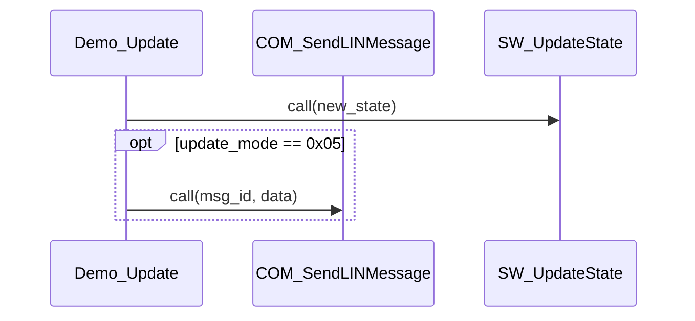
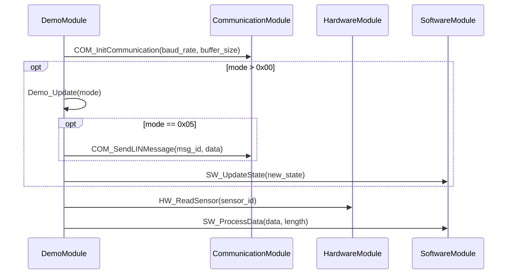

# AUTOSAR Call Tree Analyzer

[](https://badge.fury.io/py/autosar-calltree)
[](https://pypi.org/project/autosar-calltree/)
[](https://opensource.org/licenses/MIT)

A powerful Python package to analyze C/AUTOSAR codebases and generate function call trees with multiple output formats.

## Features

- ✨ **AUTOSAR Support**: Full parsing of AUTOSAR macros (`FUNC`, `FUNC_P2VAR`, `FUNC_P2CONST`, `VAR`, `P2VAR`, etc.)
- 🔍 **Static Analysis**: Analyzes C source code without compilation
- 📊 **Multiple Output Formats**:
  - Mermaid sequence diagrams (Markdown)
  - XMI/UML 2.5 (importable to Enterprise Architect, Visual Paradigm, etc.)
  - Rhapsody XMI 2.5 (importable to IBM Rhapsody 8.0+)
  - JSON (for custom processing) - *planned*
- 🏗️ **SW Module Support**: Map C files to SW modules via YAML configuration for architecture-level diagrams
- 📈 **Module-Aware Diagrams**: Generate diagrams with SW module names as participants
- 🎯 **Parameter Display**: Function parameters shown in sequence diagram calls for better visibility
- 🔄 **Automatic Conditional Detection**: Automatically detects `if`/`else` statements and generates `opt` blocks with actual conditions (Mermaid and XMI)
- 🚀 **Performance**: Intelligent caching for fast repeated analysis with file-by-file progress reporting
- 🎯 **Depth Control**: Configurable call tree depth
- 🔄 **Circular Dependency Detection**: Identifies recursive calls and cycles
- 📊 **Statistics**: Detailed analysis statistics including module distribution
- 📝 **Clean Diagrams**: Return statements omitted by default for cleaner sequence diagrams (configurable)

## What's New

### Version 0.7.0 (2026-02-14)

**🎉 Major Feature: IBM Rhapsody Export**

This release adds support for generating Rhapsody-compatible XMI 2.5 files that can be imported into IBM Rhapsody 8.0+ for further editing and visualization.

**New Features**:
- 🎯 **Rhapsody XMI Export**: New `--format rhapsody` option for Rhapsody-compatible XMI 2.5 files
- 🔑 **UUID-based IDs**: Rhapsody prefers UUID-based element IDs for better compatibility
- 📊 **Rhapsody Profiles**: Includes Rhapsody-specific profile imports and metadata
- 🏷️ **AUTOSAR Stereotypes**: Support for AUTOSAR-specific stereotypes in Rhapsody
- 🌐 **Cross-platform**: Works on Windows, Linux, and macOS (no runtime dependencies)

**CLI Usage**:
```bash
# Generate Rhapsody-compatible XMI
calltree --start-function Demo_Init --format rhapsody --source-dir demo

# With module names for architecture-level diagrams
calltree --start-function Demo_Init --format rhapsody --module-config demo/module_mapping.yaml --use-module-names
```

**Implementation**:
- `RhapsodyXmiGenerator` extends `XmiGenerator` (95% code reuse)
- Uses only Python standard library (`xml.etree.ElementTree`)
- No additional runtime dependencies required

**Benefits**:
- ✅ Cross-platform compatibility (Windows, Linux, macOS)
- ✅ Manual import via Rhapsody's native XMI import (Tools > Import > OMG UML/XMI)
- ✅ Leverages existing 521-line XMI infrastructure
- ✅ Low implementation risk (extends proven XMI generator)

**Limitations**:
- Manual import step required by user (acceptable trade-off for cross-platform compatibility)
- Requires IBM Rhapsody 8.0+ license

---

### Version 0.6.0 (2026-02-10)

**🎉 Major Feature: Loop Detection and Multi-line If Condition Support**

This release adds parsing of function calls inside `for`/`while` loops and improves multi-line if condition extraction for complex AUTOSAR code.

**New Features**:
- 🔄 **Loop Detection**: Automatically detects function calls inside `for` and `while` loops with condition extraction
- 📝 **Multi-line If Condition Extraction**: Handles complex multi-line if statements with nested parentheses and logical operators
- ✅ **Production Ready**: Verified on real AUTOSAR codebases with complex formatting

**Example Multi-line If**:
```c
// Complex multi-line condition with nested parentheses
if ((((uint32)config_ptr->settings->mode &
         ((uint32)0x1U << SLEEP_MODE)) > 0x0U) &&
    (sensor_status == SENSOR_READY))
{
    InitPeripheral();
    EnableClockControl();
}
```
**Parsed Condition**: `(((uint32)config_ptr->settings->mode & ((uint32)0x1U << SLEEP_MODE)) > 0x0U) && (sensor_status == SENSOR_READY)`

**Example Loop Detection**:
```c
while (retry_counter > 0x0U)
{
    if (InitOscillator() != E_OK)
    {
        ReportError(ERR_INIT_FAILED);
    }
    retry_counter--;
}
```
**Detected**: Loop condition `retry_counter > 0x0U` with nested conditional call `ReportError`

**Benefits**:
- ✅ Handles production AUTOSAR code with complex formatting
- ✅ Accurate condition extraction across line breaks
- ✅ Better visualization of loop-based call patterns
- ✅ Verified on real-world embedded codebases with zero parse errors

---

### Version 0.5.0 (2026-02-04)

**🎉 Major Feature: Automatic Conditional Call Detection with Opt/Alt/Else Blocks**

This release adds intelligent parsing of conditional function calls, automatically detecting `if`/`else` blocks in your C code and representing them as `opt`/`alt`/`else` blocks in both Mermaid and XMI output formats.

**Mermaid Example**:

**Source Code**:
```c
FUNC(void, RTE_CODE) Demo_Update(VAR(uint32, AUTOMATIC) update_mode)
{
    SW_UpdateState(update_mode);

    if (update_mode == 0x05) {
        COM_SendLINMessage(0x456, (uint8*)0x20003000);
    }
}
```

**Generated Mermaid Diagram**:


**XMI Example**:
```xml
<uml:fragment name="opt" interactionOperator="opt">
  <uml:operand name="update_mode == 0x05">
    <uml:message name="COM_SendLINMessage" signature="COM_SendLINMessage(msg_id, data)">
      <!-- message events -->
    </uml:message>
  </uml:operand>
</uml:fragment>
```

**Benefits**:
- ✅ No manual configuration required - automatic detection
- ✅ Shows actual condition text for better understanding
- ✅ Supports nested conditionals
- ✅ Handles `if`, `else if`, and `else` statements
- ✅ Works with both Mermaid and XMI output formats
- ✅ XMI uses UML combined fragments (standard UML 2.5 representation)

**Technical Changes**:
- `FunctionCall` model extended with `is_conditional` and `condition` fields
- `CallTreeNode` extended with `is_optional` and `condition` fields
- `CParser` enhanced with line-by-line conditional context tracking
- `MermaidGenerator` supports `opt`, `alt`, and `else` blocks
- `XMIGenerator` supports UML combined fragments
- 298 tests passing with 89% code coverage

## Changelog

### [Version 0.6.0] - 2026-02-10

#### Added
- **Loop detection**: Automatic detection of `for` and `while` loops with condition text extraction
- **Multi-line if condition extraction**: Handles complex multi-line if statements with nested parentheses
- **FunctionCall model**: Extended with `is_loop` and `loop_condition` fields
- **CallTreeNode model**: Extended with `is_loop` and `loop_condition` fields
- **CParser enhancements**: Multi-line parenthesis tracking for complete condition extraction
- Production AUTOSAR codebase verification (tested on large-scale embedded codebases)
- Requirements documentation for loop detection (SWR_PARSER_C_00021)

#### Improved
- Multi-line if condition extraction now captures complete conditions across line breaks
- Parenthesis depth tracking for complex nested conditions (4+ levels)
- Condition extraction for bitwise operations (`&`, `|`, `<<`, `>>`)
- Production code validation with zero parse errors

#### Technical
- Verified parsing of real-world AUTOSAR codebase with complex formatting
- Functions with loop calls correctly identified and tracked
- Multi-line conditions with 100+ character length properly extracted
- All existing tests passing (298 tests, 89% coverage)

---

### [Version 0.5.0] - 2026-02-04

#### Added
- **Conditional function call tracking**: Automatic detection of `if`/`else` blocks with condition text extraction
- **Mermaid opt/alt/else blocks**: Generate `opt`, `alt`, and `else` blocks for conditional calls
- **XMI combined fragments**: UML 2.5 compliant `opt`/`alt`/`else` fragment generation
- **FunctionCall model**: Extended with `is_conditional` and `condition` fields
- **CallTreeNode model**: Extended with `is_optional` and `condition` fields
- **CParser enhancements**: Line-by-line parsing to track conditional context
- Requirements documentation for conditional call tracking (SWR_MODEL_00026-00028)

#### Fixed
- Linting errors (flake8 W292, W391) for proper file endings
- Type annotations in `c_parser.py:442` for mypy compliance

#### Technical
- 298 tests passing, 89% code coverage
- All CI quality checks passing (ruff, isort, flake8, mypy)
- Python 3.8-3.12 test matrix

---

### [Version 0.4.0] - 2026-02-03

#### Added
- **XMI/UML 2.5 output format**: Complete XMI generation with UML 2.5 compliance
- **XMIGenerator**: New generator class for XMI document creation
- **CLI `--format xmi` option**: Support for XMI output format
- **CLI `--format both` option**: Generate both Mermaid and XMI simultaneously
- **XMI requirements documentation**: `docs/requirements/requirements_xmi.md`
- **UML combined fragments**: Support for `opt`, `alt`, `else` interactions
- **XMI demo output**: `demo/demo_main.xmi` example file

#### Technical
- XMI documents importable into Enterprise Architect, Visual Paradigm, MagicDraw
- Proper XML namespaces and structure (UML 2.5, XMI 2.5)
- Message events with sendEvent and receiveEvent elements

---

### [Version 0.3.3] - 2026-02-02

#### Fixed
- **AUTOSAR macro false positives**: Performance degradation caused by incorrect macro matching
- Parser optimization to reduce false positive detections
- Improved AUTOSAR pattern matching accuracy

---

### [Version 0.3.2] - 2026-02-01

#### Added
- **File size display**: Show file sizes during processing in verbose mode
- Enhanced progress reporting with line counts and file sizes
- Improved user feedback for large file processing

---

### [Version 0.3.1] - 2026-01-31

#### Added
- **Verbose file progress**: File-by-file progress display during database building
- **Line count reporting**: Show number of lines processed per file
- **Enhanced cache loading**: File-by-file progress when loading from cache
- **C parser line-by-line tests**: Comprehensive testing for line-by-line processing

#### Fixed
- Import sorting to pass isort checks
- Minor documentation updates

---

### [Version 0.3.0] - 2026-01-30

#### Added
- **SW Module Configuration System**: YAML-based file-to-module mapping
- **Module-aware diagrams**: Generate diagrams with SW module names as participants
- **Comprehensive test suite**: 298 tests across all modules (89% coverage)
- **Requirements traceability**: Complete traceability matrix between requirements and tests
- **Integration tests**: End-to-end CLI testing
- **PyPI publishing workflow**: Automated PyPI releases with OIDC trusted publishing
- **ModuleConfig class**: Load, validate, and perform module lookups
- **Module assignment**: Functions tagged with SW module information
- **FunctionDatabase integration**: Module assignments preserved in cache
- **CLI `--use-module-names` option**: Enable module-level diagrams
- **CLI `--module-config` option**: Specify module mapping YAML file

#### Technical
- Glob pattern support for file mappings (e.g., `hw_*.c`)
- Default module fallback for unmapped files
- Module lookup caching for performance
- Cache preserves module assignments across runs

---

### Earlier Versions

**Version 0.2.x** - Initial development releases with basic AUTOSAR parsing and Mermaid output

## Installation

```bash
pip install autosar-calltree
```

For development:

```bash
git clone https://github.com/melodypapa/autosar-calltree.git
cd autosar-calltree
pip install -e ".[dev]"
```

## Building Distribution Packages

This project uses `pyproject.toml` for modern Python packaging (PEP 621). To build distribution packages:

```bash
# Install build dependencies
pip install build

# Build source distribution (sdist) and wheel
python -m build

# The built packages will be in the dist/ directory:
# - autosar_calltree-<version>.tar.gz  (source distribution)
# - autosar_calltree-<version>-py3-none-any.whl  (wheel)
```

To install from the built packages:

```bash
pip install dist/autosar_calltree-<version>-py3-none-any.whl
```

**Note**: This project no longer uses `setup.py`. All configuration is managed through `pyproject.toml`.

## Quick Start

### Basic Usage

```bash
# Analyze a function with default settings (depth=3)
calltree --start-function Demo_Init --source-dir demo

# Use SW module configuration for architecture-level diagrams
calltree --start-function Demo_Init --source-dir demo --module-config demo/module_mapping.yaml --use-module-names --output demo/demo.md

# Specify depth and output
calltree --start-function Demo_Init --max-depth 2 -o output.md

# Generate XMI format (with opt block support)
calltree --start-function Demo_MainFunction --source-dir demo --format xmi --output demo/demo.xmi

# Generate Rhapsody-compatible XMI
calltree --start-function Demo_Init --format rhapsody --source-dir demo --output demo/rhapsody_demo.xmi

# Verbose mode with detailed statistics and cache progress
calltree --start-function Demo_Init --verbose
```

### Python API

```python
from autosar_calltree.database.function_database import FunctionDatabase
from autosar_calltree.analyzers.call_tree_builder import CallTreeBuilder
from autosar_calltree.generators.mermaid_generator import MermaidGenerator
from autosar_calltree.config.module_config import ModuleConfig
from pathlib import Path

# Load module configuration (optional)
config = ModuleConfig(Path("demo/module_mapping.yaml"))

# Build function database (with caching and module config)
db = FunctionDatabase(source_dir="demo", module_config=config)
db.build_database(use_cache=True)

# Build call tree
builder = CallTreeBuilder(db)
result = builder.build_tree(
    start_function="Demo_Init",
    max_depth=3
)

# Generate Mermaid diagram with module names and parameters
# include_returns=False (default) omits return statements for cleaner diagrams
generator = MermaidGenerator(
    use_module_names=True,
    include_returns=False
)
generator.generate(result, output_path="call_tree.md")
```

## Command-Line Options

```
calltree [OPTIONS]

Options:
  --start-function TEXT          Starting function name [required]
  --max-depth INTEGER           Maximum call depth (default: 3)
  --source-dir PATH             Source code directory (default: ./demo)
  --format [mermaid|xmi|rhapsody|both]   Output format (default: mermaid)
  --output PATH                 Output file path (default: call_tree.md)
  --module-config PATH          YAML file mapping C files to SW modules
  --use-module-names            Use SW module names as Mermaid participants
  --cache-dir PATH              Cache directory (default: <source-dir>/.cache)
  --no-cache                    Disable cache usage
  --rebuild-cache               Force rebuild of cache
  --no-abbreviate-rte           Do not abbreviate RTE function names
  --verbose, -v                 Enable verbose output
  --list-functions, -l          List all available functions and exit
  --search TEXT                 Search for functions matching pattern
  --help                        Show this message and exit
```

## Output Examples

### Mermaid Sequence Diagram with Opt Blocks



**Key Features**:
- Conditional calls are automatically wrapped in `opt` blocks
- Shows actual condition text from source code (e.g., `mode > 0x00`, `mode == 0x05`)
- Supports nested conditionals
- Participants appear in the order they are first encountered
- Function parameters are displayed in the call arrows
- Return statements are omitted by default for cleaner visualization
- Module names are used as participants when `--use-module-names` is enabled

### XMI Output with Opt Blocks

The XMI output also supports opt blocks using UML combined fragments:

```xml
<uml:fragment name="opt" interactionOperator="opt">
  <uml:operand name="update_mode == 0x05">
    <uml:message name="COM_SendLINMessage" 
                 signature="COM_SendLINMessage(msg_id, data)"
                 messageSort="synchCall">
      <uml:sendEvent xmi:id="calltree_22"/>
      <uml:receiveEvent xmi:id="calltree_23"/>
    </uml:message>
  </uml:operand>
</uml:fragment>
```

**XMI Features**:
- UML 2.5 compliant XMI documents
- Combined fragments with `opt` interaction operator
- Operand elements display the condition text
- Can be imported into UML tools like Enterprise Architect, Visual Paradigm, MagicDraw
- Proper XML structure with correct namespaces

### Generated Markdown Structure

The tool generates comprehensive Markdown files with:
- Metadata header (timestamp, settings, statistics)
- Mermaid sequence diagram with function parameters and opt blocks
- Function details table with parameter information
- Text-based call tree
- Circular dependency warnings
- Analysis statistics

**Note**: Return statements are omitted from sequence diagrams by default for cleaner visualization. This can be configured programmatically when using the Python API.

## Supported AUTOSAR Patterns

The tool recognizes and parses:

```c
// AUTOSAR function declarations
FUNC(void, RTE_CODE) Function_Name(void);
FUNC(Std_ReturnType, RTE_CODE) Com_Test(VAR(uint32, AUTOMATIC) timerId);
STATIC FUNC(uint8, CODE) Internal_Function(void);

// AUTOSAR pointer returns
FUNC_P2VAR(uint8, AUTOMATIC, APPL_VAR) Get_Buffer(void);
FUNC_P2CONST(ConfigType, AUTOMATIC, APPL_VAR) Get_Config(void);

// AUTOSAR parameters
VAR(uint32, AUTOMATIC) variable
P2VAR(uint8, AUTOMATIC, APPL_DATA) buffer
P2CONST(ConfigType, AUTOMATIC, APPL_DATA) config
CONST(uint16, AUTOMATIC) constant

// Traditional C (fallback)
void traditional_function(uint8 param);
static uint32 helper_function(void);
```

## SW Module Configuration

Map C source files to SW modules using YAML configuration:

```yaml
# module_mapping.yaml
version: "1.0"

# Specific file mappings
file_mappings:
  demo.c: DemoModule

# Pattern-based mappings (glob patterns)
pattern_mappings:
  "hw_*.c": HardwareModule
  "sw_*.c": SoftwareModule
  "com_*.c": CommunicationModule

# Default module for unmapped files (optional)
default_module: "Other"
```

**Benefits**:
- Generate architecture-level diagrams showing module interactions
- Identify cross-module dependencies
- Verify architectural boundaries
- Support high-level design documentation

**Usage**:
```bash
calltree --start-function Demo_Init --module-config demo/module_mapping.yaml --use-module-names --max-depth 3 --output demo/demo_sequence.md
```

This generates diagrams with:
- **Participants**: SW module names (HardwareModule, SoftwareModule, etc.) in the order they are first encountered
- **Arrows**: Function names with parameters being called between modules
- **Opt Blocks**: Conditional calls wrapped with actual condition text
- **Function Table**: Includes module column showing each function's SW module
- **Clean Visualization**: Return statements omitted by default

## Use Cases

- **Documentation**: Generate call flow diagrams for documentation
- **Code Review**: Visualize function dependencies
- **Impact Analysis**: Understand change impact before modifications
- **Onboarding**: Help new developers understand codebase structure
- **Compliance**: Generate diagrams for safety certification (ISO 26262)
- **Refactoring**: Identify tightly coupled components
- **Architecture**: Verify architectural boundaries

## Project Structure

```
autosar-calltree/
├── src/autosar_calltree/
│   ├── cli/              # Command-line interface
│   ├── config/           # Configuration management (module mappings)
│   ├── parsers/          # Code parsers (AUTOSAR, C)
│   ├── analyzers/        # Analysis logic (call tree, dependencies)
│   ├── database/         # Data models and caching
│   ├── generators/       # Output generators (Mermaid, XMI)
│   └── utils/            # Utilities (empty, for future use)
├── test_demo/            # Demo AUTOSAR C files for testing
│   ├── demo.c
│   ├── hardware.c
│   ├── software.c
│   ├── communication.c
│   └── module_mapping.yaml
├── tests/                # Test suite (empty, for future use)
├── docs/                 # Documentation
│   └── requirements/     # Software requirements
└── examples/             # Example scripts (empty, for future use)
```

## Development

### Running Tests

The project has **comprehensive test coverage** with 298 tests across all modules:

```bash
# Run all tests
pytest tests/

# Run with verbose output
pytest -vv tests/

# Run specific test module
pytest tests/test_models.py
pytest tests/test_parsers.py
pytest tests/test_database.py
pytest tests/test_analyzers.py
pytest tests/test_config.py
pytest tests/test_generators.py
pytest tests/test_cli.py
pytest tests/test_integration.py

# Run specific test case
pytest tests/test_models.py::TestFunctionType::test_function_type_enum_values

# Run tests with live stdout output (useful for debugging)
pytest -vv -s tests/

# Run tests and show coverage report
pytest --cov=autosar_calltree --cov-report=html --cov-report=term

# Run tests with coverage and omit tests from coverage report
pytest --cov=autosar_calltree --cov-report=html --cov-report=term --omit=tests/
```

### Test Coverage

The project maintains **89% code coverage** across all modules:

| Module | Coverage | Tests |
|--------|----------|-------|
| Models | 97% | 28 |
| AUTOSAR Parser | 97% | 15 |
| C Parser | 86% | 18 |
| Database | 83% | 20 |
| Analyzers | 95% | 20 |
| Config | 97% | 25 |
| Generators | 89% | 45 |
| CLI (Integration) | 90% | 14 |
| End-to-End | ~90% | 120 |
| **Total** | **89%** | **298** |

### Code Quality

```bash
# Format code with Black
black src/ tests/

# Sort imports with isort
isort src/ tests/

# Lint with flake8
flake8 src/ tests/

# Type checking with mypy
mypy src/

# Run all quality checks (uses pre-configured scripts)
./scripts/run_quality.sh

# Check for traceability between requirements and tests
python scripts/check_traceability.py
```

### Slash Commands

The project provides convenient slash commands for common development tasks:

```bash
# Run all tests
/test

# Run quality checks
/quality

# Test requirement management
/req

# Merge a pull request
/merge-pr

# Generate GitHub workflow
/gh-workflow

# Parse and update documentation
/parse

# Sync documentation
/sync-docs
```

These commands are documented in `.claude/commands/` and can be used from within Claude Code.

### Requirements Traceability

The project maintains 100% traceability between requirements and tests:

```bash
# Check traceability matrix
python scripts/check_traceability.py

# View traceability documentation
cat docs/TRACEABILITY.md

# View requirements index
cat docs/requirements/README.md

# View test index
cat docs/tests/README.md
```

### Building Documentation

```bash
cd docs
make html
```

## Contributing

Contributions are welcome! Please:

1. Fork the repository
2. Create a feature branch
3. Add tests for new functionality
4. Ensure all tests pass
5. Submit a pull request

See [CONTRIBUTING.md](CONTRIBUTING.md) for detailed guidelines.

## License

MIT License - see [LICENSE](LICENSE) file for details.

## Authors

- Melodypapa <melodypapa@outlook.com>

## Acknowledgments

- Inspired by the need for better AUTOSAR code analysis tools
- Built for the automotive embedded systems community

## Related Projects

- [PlantUML](https://plantuml.com/) - UML diagram generator
- [Doxygen](https://www.doxygen.nl/) - Documentation generator
- [cflow](https://www.gnu.org/software/cflow/) - C call graph generator

## Roadmap

- [ ] PlantUML output format
- [ ] GraphViz DOT format
- [ ] HTML interactive viewer
- [ ] VS Code extension
- [ ] GitHub Actions integration
- [x] Configuration file support (YAML for module mappings)
- [ ] Multi-threading for large codebases
- [ ] Function complexity metrics
- [ ] Dead code detection
- [x] XMI/UML 2.5 output format with opt block support
- [x] Automatic conditional call detection with opt blocks

## Support

- **Issues**: [GitHub Issues](https://github.com/melodypapa/autosar-calltree/issues)
- **Documentation**: [Read the Docs](https://autosar-calltree.readthedocs.io)
- **Discussions**: [GitHub Discussions](https://github.com/melodypapa/autosar-calltree/discussions)

---

**Made with ❤️ for the embedded systems community**