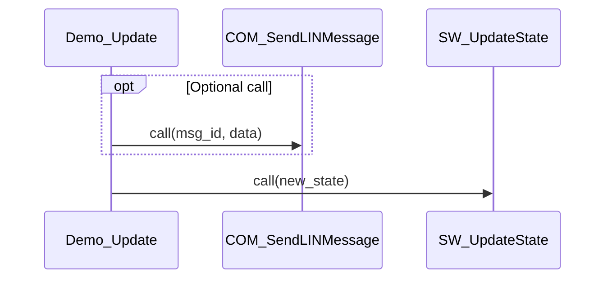

# Call Tree: Demo_Update

## Metadata

- **Root Function**: `Demo_Update`
- **Generated**: 2026-02-04 23:00:38
- **Total Functions**: 3
- **Unique Functions**: 3
- **Max Depth**: 1
- **Circular Dependencies**: 0

## Sequence Diagram



## Function Details

| Function | File | Line | Return Type | Parameters |
|----------|------|------|-------------|------------|
| `COM_SendLINMessage` | communication.c | 42 | `void` | `uint32 msg_id`<br>`uint8* data` |
| `Demo_Update` | demo.c | 38 | `void` | `uint32 update_mode` |
| `SW_UpdateState` | software.c | 38 | `void` | `uint32 new_state` |

## Call Tree (Text)

```
Demo_Update (demo.c:38)
├── COM_SendLINMessage (communication.c:42)
└── SW_UpdateState (software.c:38)
```
