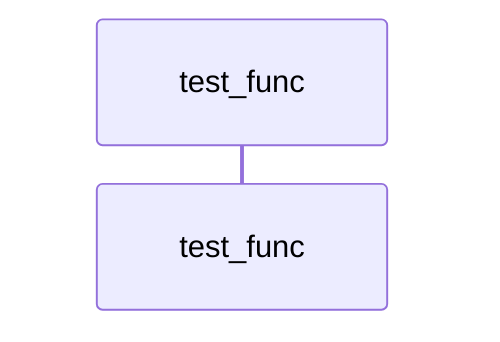

# Call Tree: test_func

## Metadata

- **Root Function**: `test_func`
- **Generated**: 2026-02-13 23:01:50
- **Total Functions**: 1
- **Unique Functions**: 1
- **Max Depth**: 0
- **Circular Dependencies**: 0

## Sequence Diagram



## Function Details

| Function | File | Line | Return Type | Parameters |
|----------|------|------|-------------|------------|
| `test_func` | test.c | 13 | `void` | `void` |

## Call Tree (Text)

```
test_func (test.c:13)
```
