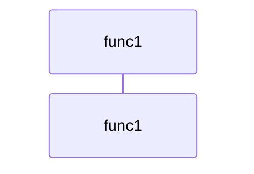

# Call Tree: func1

## Metadata

- **Root Function**: `func1`
- **Generated**: 2026-02-12 21:20:37
- **Total Functions**: 1
- **Unique Functions**: 1
- **Max Depth**: 0
- **Circular Dependencies**: 0

## Sequence Diagram



## Function Details

| Function | File | Line | Return Type | Parameters |
|----------|------|------|-------------|------------|
| `func1` | func1.c | 13 | `void` | `void` |

## Call Tree (Text)

```
func1 (func1.c:13)
```
