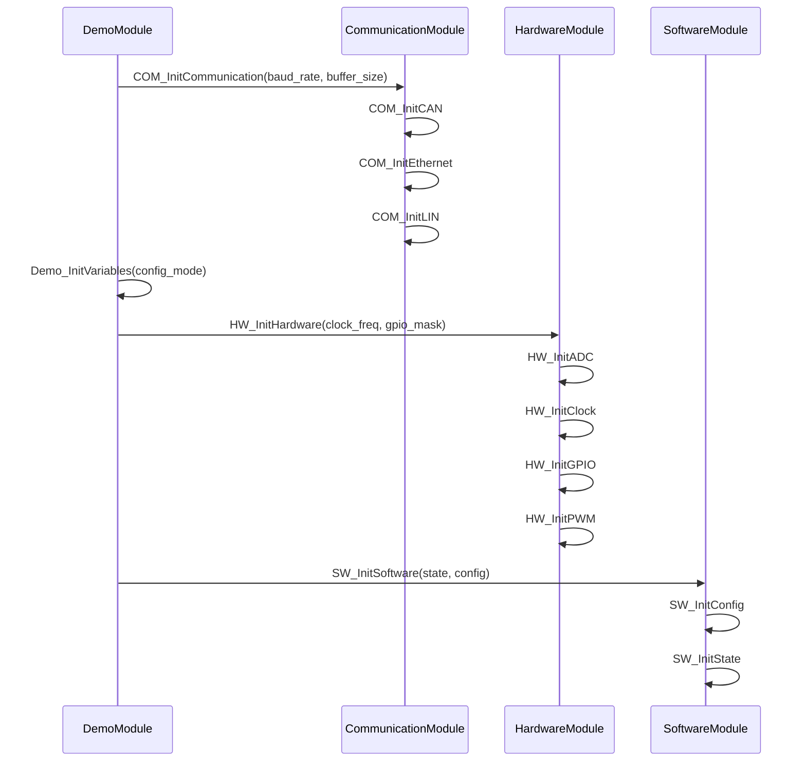

# Call Tree: Demo_Init

## Metadata

- **Root Function**: `Demo_Init`
- **Generated**: 2026-01-29 22:58:49
- **Total Functions**: 14
- **Unique Functions**: 14
- **Max Depth**: 2
- **Circular Dependencies**: 0

## Sequence Diagram



## Function Details

| Function | Module | File | Line | Return Type | Parameters |
|----------|--------|------|------|-------------|------------|
| `COM_InitCAN` | CommunicationModule | communication.c | 6 | `void` | `void` |
| `COM_InitCommunication` | CommunicationModule | communication.c | 24 | `void` | `uint32 baud_rate`<br>`uint16 buffer_size` |
| `COM_InitEthernet` | CommunicationModule | communication.c | 18 | `void` | `void` |
| `COM_InitLIN` | CommunicationModule | communication.c | 12 | `void` | `void` |
| `Demo_Init` | DemoModule | demo.c | 6 | `void` | `void` |
| `Demo_InitVariables` | DemoModule | demo.c | 17 | `void` | `uint32 config_mode` |
| `HW_InitADC` | HardwareModule | hardware.c | 24 | `void` | `void` |
| `HW_InitClock` | HardwareModule | hardware.c | 6 | `void` | `void` |
| `HW_InitGPIO` | HardwareModule | hardware.c | 12 | `void` | `void` |
| `HW_InitHardware` | HardwareModule | hardware.c | 30 | `void` | `uint32 clock_freq`<br>`uint32 gpio_mask` |
| `HW_InitPWM` | HardwareModule | hardware.c | 18 | `void` | `void` |
| `SW_InitConfig` | SoftwareModule | software.c | 12 | `void` | `void` |
| `SW_InitSoftware` | SoftwareModule | software.c | 18 | `void` | `uint8 state`<br>`uint8 config` |
| `SW_InitState` | SoftwareModule | software.c | 6 | `void` | `void` |

## Call Tree (Text)

```
Demo_Init (demo.c:6)
├── COM_InitCommunication (communication.c:24)
│   ├── COM_InitCAN (communication.c:6)
│   ├── COM_InitEthernet (communication.c:18)
│   └── COM_InitLIN (communication.c:12)
├── Demo_InitVariables (demo.c:17)
├── HW_InitHardware (hardware.c:30)
│   ├── HW_InitADC (hardware.c:24)
│   ├── HW_InitClock (hardware.c:6)
│   ├── HW_InitGPIO (hardware.c:12)
│   └── HW_InitPWM (hardware.c:18)
└── SW_InitSoftware (software.c:18)
    ├── SW_InitConfig (software.c:12)
    └── SW_InitState (software.c:6)
```
