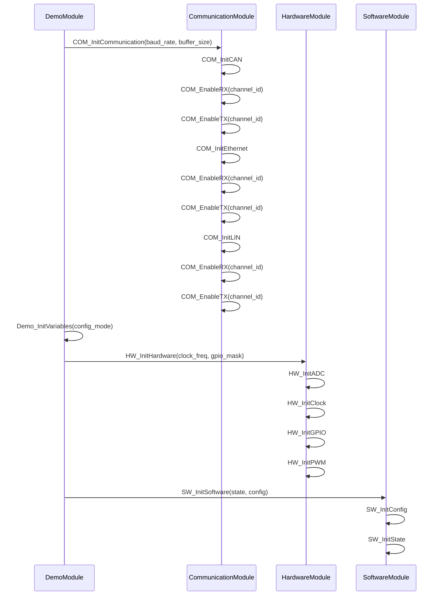

# Call Tree: Demo_Init

## Metadata

- **Root Function**: `Demo_Init`
- **Generated**: 2026-03-01 18:28:56
- **Total Functions**: 20
- **Unique Functions**: 16
- **Max Depth**: 3
- **Circular Dependencies**: 0

## Sequence Diagram


```mermaid
sequenceDiagram
    participant DemoModule
    participant CommunicationModule
    participant HardwareModule
    participant SoftwareModule

    DemoModule->>CommunicationModule: COM_InitCommunication(baud_rate, buffer_size)
    CommunicationModule->>CommunicationModule: COM_InitCAN
    CommunicationModule->>CommunicationModule: COM_EnableRX(channel_id)
    CommunicationModule->>CommunicationModule: COM_EnableTX(channel_id)
    CommunicationModule->>CommunicationModule: COM_InitEthernet
    CommunicationModule->>CommunicationModule: COM_EnableRX(channel_id)
    CommunicationModule->>CommunicationModule: COM_EnableTX(channel_id)
    CommunicationModule->>CommunicationModule: COM_InitLIN
    CommunicationModule->>CommunicationModule: COM_EnableRX(channel_id)
    CommunicationModule->>CommunicationModule: COM_EnableTX(channel_id)
    DemoModule->>DemoModule: Demo_InitVariables(config_mode)
    DemoModule->>HardwareModule: HW_InitHardware(clock_freq, gpio_mask)
    HardwareModule->>HardwareModule: HW_InitADC
    HardwareModule->>HardwareModule: HW_InitClock
    HardwareModule->>HardwareModule: HW_InitGPIO
    HardwareModule->>HardwareModule: HW_InitPWM
    DemoModule->>SoftwareModule: SW_InitSoftware(state, config)
    SoftwareModule->>SoftwareModule: SW_InitConfig
    SoftwareModule->>SoftwareModule: SW_InitState
```

## Function Details

| Function | Module | File | Line | Return Type | Parameters |
|----------|--------|------|------|-------------|------------|
| `COM_EnableRX` | CommunicationModule | communication.c | 104 | `void` | `uint32 channel_id` |
| `COM_EnableTX` | CommunicationModule | communication.c | 92 | `void` | `uint32 channel_id` |
| `COM_InitCAN` | CommunicationModule | communication.c | 10 | `void` | `void` |
| `COM_InitCommunication` | CommunicationModule | communication.c | 34 | `void` | `uint32 baud_rate`<br>`uint16 buffer_size` |
| `COM_InitEthernet` | CommunicationModule | communication.c | 26 | `void` | `void` |
| `COM_InitLIN` | CommunicationModule | communication.c | 18 | `void` | `void` |
| `Demo_Init` | DemoModule | demo.c | 9 | `void` | `void` |
| `Demo_InitVariables` | DemoModule | demo.c | 20 | `void` | `uint32 config_mode` |
| `HW_InitADC` | HardwareModule | hardware.c | 28 | `void` | `void` |
| `HW_InitClock` | HardwareModule | hardware.c | 10 | `void` | `void` |
| `HW_InitGPIO` | HardwareModule | hardware.c | 16 | `void` | `void` |
| `HW_InitHardware` | HardwareModule | hardware.c | 34 | `void` | `uint32 clock_freq`<br>`uint32 gpio_mask` |
| `HW_InitPWM` | HardwareModule | hardware.c | 22 | `void` | `void` |
| `SW_InitConfig` | SoftwareModule | software.c | 16 | `void` | `void` |
| `SW_InitSoftware` | SoftwareModule | software.c | 22 | `void` | `uint8 state`<br>`uint8 config` |
| `SW_InitState` | SoftwareModule | software.c | 10 | `void` | `void` |

## Call Tree (Text)

```
Demo_Init (demo.c:9)
├── COM_InitCommunication (communication.c:34)
│   ├── COM_InitCAN (communication.c:10)
│   │   ├── COM_EnableRX (communication.c:104)
│   │   └── COM_EnableTX (communication.c:92)
│   ├── COM_InitEthernet (communication.c:26)
│   │   ├── COM_EnableRX (communication.c:104)
│   │   └── COM_EnableTX (communication.c:92)
│   └── COM_InitLIN (communication.c:18)
│       ├── COM_EnableRX (communication.c:104)
│       └── COM_EnableTX (communication.c:92)
├── Demo_InitVariables (demo.c:20)
├── HW_InitHardware (hardware.c:34)
│   ├── HW_InitADC (hardware.c:28)
│   ├── HW_InitClock (hardware.c:10)
│   ├── HW_InitGPIO (hardware.c:16)
│   └── HW_InitPWM (hardware.c:22)
└── SW_InitSoftware (software.c:22)
    ├── SW_InitConfig (software.c:16)
    └── SW_InitState (software.c:10)
```
