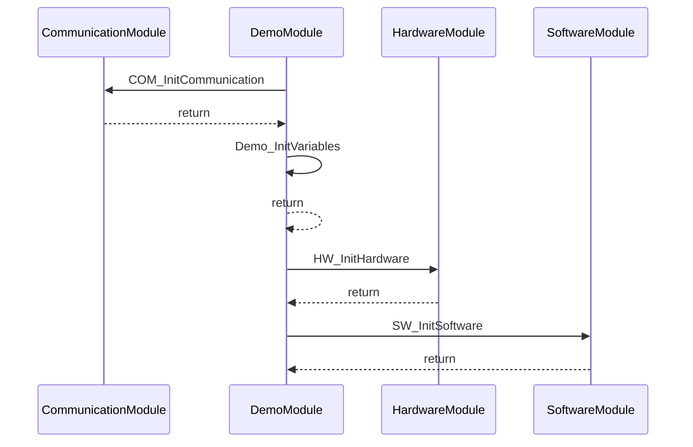

# Call Tree: Demo_Init

## Metadata

- **Root Function**: `Demo_Init`
- **Generated**: 2026-01-29 18:13:40
- **Total Functions**: 5
- **Unique Functions**: 5
- **Max Depth**: 1
- **Circular Dependencies**: 0

## Sequence Diagram



## Function Details

| Function | Module | File | Line | Return Type | Parameters |
|----------|--------|------|------|-------------|------------|
| `COM_InitCommunication` | CommunicationModule | communication.c | 24 | `void` | `void` |
| `Demo_Init` | DemoModule | demo.c | 6 | `void` | `void` |
| `Demo_InitVariables` | DemoModule | demo.c | 17 | `void` | `void` |
| `HW_InitHardware` | HardwareModule | hardware.c | 30 | `void` | `void` |
| `SW_InitSoftware` | SoftwareModule | software.c | 18 | `void` | `void` |

## Call Tree (Text)

```
Demo_Init (demo.c:6)
├── COM_InitCommunication (communication.c:24)
├── Demo_InitVariables (demo.c:17)
├── HW_InitHardware (hardware.c:30)
└── SW_InitSoftware (software.c:18)
```
