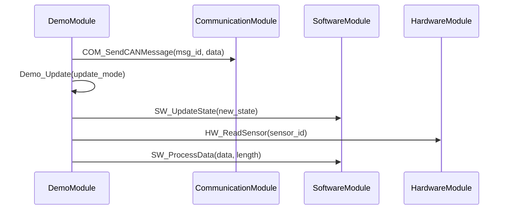

# Call Tree: Demo_MainFunction

## Metadata

- **Root Function**: `Demo_MainFunction`
- **Generated**: 2026-01-29 22:58:59
- **Total Functions**: 6
- **Unique Functions**: 6
- **Max Depth**: 2
- **Circular Dependencies**: 0

## Sequence Diagram



## Function Details

| Function | Module | File | Line | Return Type | Parameters |
|----------|--------|------|------|-------------|------------|
| `COM_SendCANMessage` | CommunicationModule | communication.c | 35 | `void` | `uint32 msg_id`<br>`uint8 data` |
| `Demo_MainFunction` | DemoModule | demo.c | 23 | `void` | `void` |
| `Demo_Update` | DemoModule | demo.c | 34 | `void` | `uint32 update_mode` |
| `HW_ReadSensor` | HardwareModule | hardware.c | 42 | `uint32` | `uint32 sensor_id` |
| `SW_ProcessData` | SoftwareModule | software.c | 28 | `uint32` | `uint8 data`<br>`uint32 length` |
| `SW_UpdateState` | SoftwareModule | software.c | 38 | `void` | `uint32 new_state` |

## Call Tree (Text)

```
Demo_MainFunction (demo.c:23)
├── COM_SendCANMessage (communication.c:35)
├── Demo_Update (demo.c:34)
│   └── SW_UpdateState (software.c:38)
├── HW_ReadSensor (hardware.c:42)
└── SW_ProcessData (software.c:28)
```
