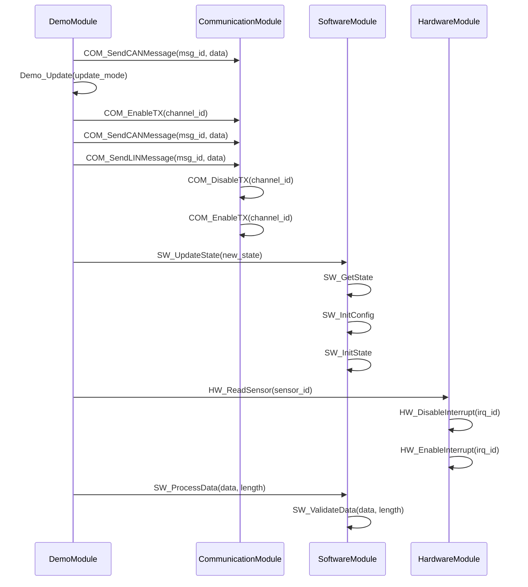

# Call Tree: Demo_MainFunction

## Metadata

- **Root Function**: `Demo_MainFunction`
- **Generated**: 2026-03-01 18:29:01
- **Total Functions**: 17
- **Unique Functions**: 15
- **Max Depth**: 3
- **Circular Dependencies**: 0

## Sequence Diagram


```mermaid
sequenceDiagram
    participant DemoModule
    participant CommunicationModule
    participant SoftwareModule
    participant HardwareModule

    DemoModule->>CommunicationModule: COM_SendCANMessage(msg_id, data)
    DemoModule->>DemoModule: Demo_Update(update_mode)
    DemoModule->>CommunicationModule: COM_EnableTX(channel_id)
    DemoModule->>CommunicationModule: COM_SendCANMessage(msg_id, data)
    DemoModule->>CommunicationModule: COM_SendLINMessage(msg_id, data)
    CommunicationModule->>CommunicationModule: COM_DisableTX(channel_id)
    CommunicationModule->>CommunicationModule: COM_EnableTX(channel_id)
    DemoModule->>SoftwareModule: SW_UpdateState(new_state)
    SoftwareModule->>SoftwareModule: SW_GetState
    SoftwareModule->>SoftwareModule: SW_InitConfig
    SoftwareModule->>SoftwareModule: SW_InitState
    DemoModule->>HardwareModule: HW_ReadSensor(sensor_id)
    HardwareModule->>HardwareModule: HW_DisableInterrupt(irq_id)
    HardwareModule->>HardwareModule: HW_EnableInterrupt(irq_id)
    DemoModule->>SoftwareModule: SW_ProcessData(data, length)
    SoftwareModule->>SoftwareModule: SW_ValidateData(data, length)
```

## Function Details

| Function | Module | File | Line | Return Type | Parameters |
|----------|--------|------|------|-------------|------------|
| `COM_DisableTX` | CommunicationModule | communication.c | 98 | `void` | `uint32 channel_id` |
| `COM_EnableTX` | CommunicationModule | communication.c | 92 | `void` | `uint32 channel_id` |
| `COM_SendCANMessage` | CommunicationModule | communication.c | 51 | `void` | `uint32 msg_id`<br>`uint8* data` |
| `COM_SendLINMessage` | CommunicationModule | communication.c | 65 | `void` | `uint32 msg_id`<br>`uint8* data` |
| `Demo_MainFunction` | DemoModule | demo.c | 26 | `void` | `void` |
| `Demo_Update` | DemoModule | demo.c | 55 | `void` | `uint32 update_mode` |
| `HW_DisableInterrupt` | HardwareModule | hardware.c | 90 | `void` | `uint32 irq_id` |
| `HW_EnableInterrupt` | HardwareModule | hardware.c | 84 | `void` | `uint32 irq_id` |
| `HW_ReadSensor` | HardwareModule | hardware.c | 52 | `uint32` | `uint32 sensor_id` |
| `SW_GetState` | SoftwareModule | software.c | 69 | `uint32` | `void` |
| `SW_InitConfig` | SoftwareModule | software.c | 16 | `void` | `void` |
| `SW_InitState` | SoftwareModule | software.c | 10 | `void` | `void` |
| `SW_ProcessData` | SoftwareModule | software.c | 32 | `uint32` | `uint8* data`<br>`uint32 length` |
| `SW_UpdateState` | SoftwareModule | software.c | 51 | `void` | `uint32 new_state` |
| `SW_ValidateData` | SoftwareModule | software.c | 98 | `void` | `uint8* data`<br>`uint32 length` |

## Call Tree (Text)

```
Demo_MainFunction (demo.c:26)
├── COM_SendCANMessage (communication.c:51)
├── Demo_Update (demo.c:55)
│   ├── COM_EnableTX (communication.c:92)
│   ├── COM_SendCANMessage (communication.c:51)
│   ├── COM_SendLINMessage (communication.c:65)
│   │   ├── COM_DisableTX (communication.c:98)
│   │   └── COM_EnableTX (communication.c:92)
│   └── SW_UpdateState (software.c:51)
│       ├── SW_GetState (software.c:69)
│       ├── SW_InitConfig (software.c:16)
│       └── SW_InitState (software.c:10)
├── HW_ReadSensor (hardware.c:52)
│   ├── HW_DisableInterrupt (hardware.c:90)
│   └── HW_EnableInterrupt (hardware.c:84)
└── SW_ProcessData (software.c:32)
    └── SW_ValidateData (software.c:98)
```
