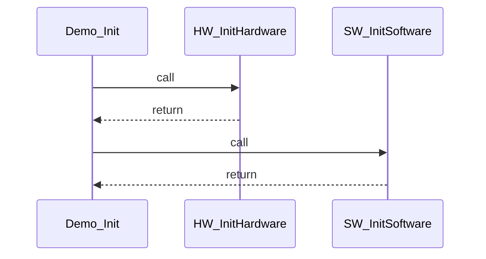
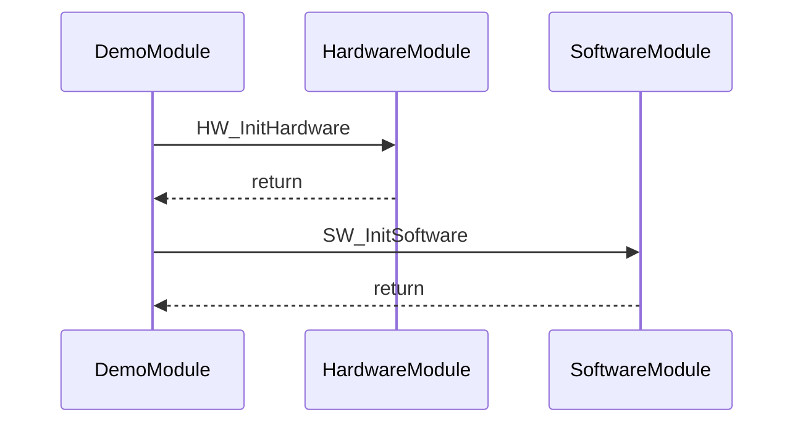

# Mermaid Module Names Requirements

## SWR_MERMAID_00001: Module-Based Participants

**Title**: Use SW module names as Mermaid diagram participants

**Maturity**: accept

**Description**:
When enabled via the `--use-module-names` flag, the Mermaid generator shall use SW module names as diagram participants instead of individual function names. Function names shall be displayed on the arrows between modules.

**Rationale**:
Module-based diagrams provide a higher-level view of system architecture. This is particularly useful for:
- Understanding cross-module dependencies
- Identifying architectural layers
- Verifying module boundaries
- Documentation at the system design level

**Functional Requirements**:

1. **Participant Names**:
   - When `--use-module-names` is enabled, participants shall be SW module names
   - Module names shall be obtained from the `sw_module` field of `FunctionInfo`
   - If a function has no module assigned, the filename (without extension) shall be used
   - Each unique module shall appear only once in the participant list

2. **Call Labels**:
   - Arrows between modules shall show the function name being called
   - The label format shall be: `ModuleA->>ModuleB: FunctionName`
   - Return arrows shall show "return"
   - Recursive calls shall show "FunctionName [recursive]"

3. **Backward Compatibility**:
   - The feature shall be opt-in via `--use-module-names` flag
   - When disabled, the tool shall use function names as participants (current behavior)
   - The default behavior shall remain unchanged (function names as participants)

4. **Integration with Module Configuration**:
   - `--use-module-names` requires `--module-config` to be specified
   - If `--use-module-names` is used without `--module-config`, a warning shall be displayed
   - The tool shall fall back to function name participants in this case

**Implementation Notes**:

- Implemented in `src/autosar_calltree/generators/mermaid_generator.py`
- The `use_module_names` parameter controls this behavior
- `_collect_participants()` returns module names when enabled
- `_generate_sequence_calls()` uses function names as arrow labels when enabled

**Example Output**:

**Without `--use-module-names`** (current behavior):

**With `--use-module-names`** (new behavior):

## SWR_MERMAID_00002: Module Column in Function Table

**Title**: Include module information in function details table

**Maturity**: accept

**Description**:
When `--use-module-names` is enabled, the function details table in the generated markdown shall include a "Module" column showing the SW module for each function.

**Functional Requirements**:

1. **Table Header**:
   - When enabled, the table shall include a "Module" column
   - Column order shall be: Function | Module | File | Line | Return Type | Parameters
   - When disabled, the table shall have the original format (no Module column)

2. **Module Display**:
   - Functions with assigned modules shall display the module name
   - Functions without assigned modules shall display "N/A"
   - Module names shall be rendered as plain text (not code)

3. **Table Formatting**:
   - The table shall use standard Markdown table syntax
   - All alignment and spacing shall follow Markdown best practices

**Implementation Notes**:

- Implemented in `MermaidGenerator._generate_function_table()`
- Table structure changes based on `self.use_module_names` flag
- Module value comes from `func.sw_module`

## SWR_MERMAID_00003: Fallback Behavior

**Title**: Graceful fallback for unmapped files

**Maturity**: accept

**Description**:
When using module-based participants, functions without module assignments shall gracefully fall back to using filename-based module names.

**Functional Requirements**:

1. **Unmapped Files**:
   - Functions without `sw_module` assignment shall use their filename (without extension) as participant name
   - This ensures every function has a valid participant
   - No function shall be excluded from the diagram

2. **Fallback Display**:
   - Filename-based participants shall be formatted consistently
   - The filename shall be the base name without path or extension
   - Example: `hardware.c` becomes participant `hardware`

3. **Module Column**:
   - In the function table, unmapped functions shall display "N/A" in the Module column
   - This clearly distinguishes mapped from unmapped functions

**Rationale**:
Not all files may be covered by the module configuration. Fallback to filename ensures complete diagrams while still showing which functions have explicit module assignments.

**Error Handling**:

- No errors shall occur for unmapped files
- The tool shall generate complete diagrams even with partial coverage
- Verbose mode may show warnings about unmapped files
