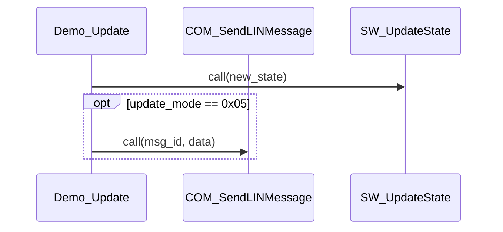
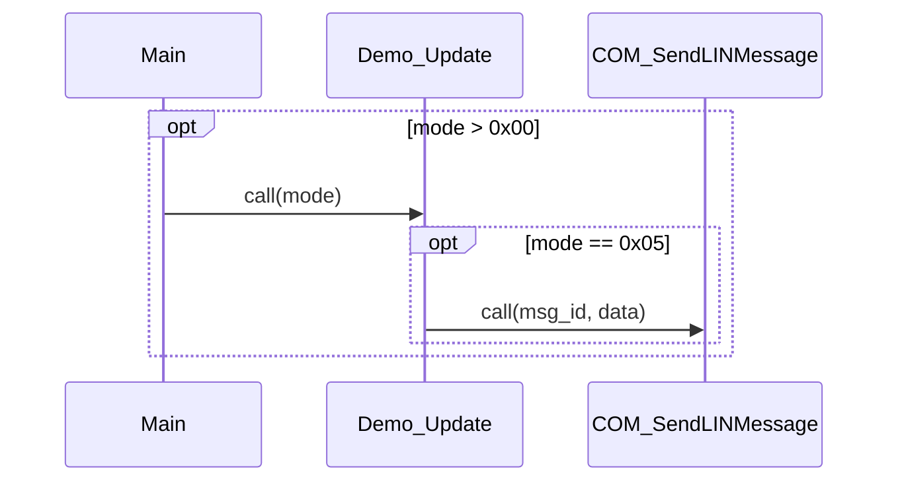

# Mermaid Opt Blocks Requirements

## SWR_MERMAID_00004: Automatic Conditional Call Detection

**Title**: Automatically detect if/else statements and generate opt blocks

**Maturity**: accept

**Description**:
The tool shall automatically detect function calls inside `if`, `else if`, and `else` statements and display them in Mermaid `opt` blocks with the actual condition text.

**Rationale**:
Conditional function calls represent optional execution paths in the code. Displaying them in `opt` blocks with the actual condition provides:
- Clear visual indication of conditional logic
- Better understanding of control flow
- More accurate sequence diagrams that reflect source code structure
- No manual configuration required - automatic detection

**Functional Requirements**:

1. **Conditional Detection**:
   - The parser shall detect function calls inside `if` statements
   - The parser shall detect function calls inside `else if` statements
   - The parser shall detect function calls inside `else` statements
   - The parser shall track brace depth to correctly identify nested conditionals
   - Multiple calls inside the same conditional block shall be wrapped in a single `opt` block

2. **Condition Extraction**:
   - The tool shall extract the condition text from `if` statements
   - The condition text shall be displayed in the `opt` block label
   - For `else if` statements, the condition text shall be displayed
   - For `else` statements, the label shall display "else"
   - Example: `if (update_mode == 0x05)` → `opt update_mode == 0x05`

3. **Opt Block Generation**:
   - Conditional calls shall be wrapped in `opt` blocks
   - The `opt` block label shall show the condition text
   - Nested conditionals shall generate nested `opt` blocks
   - Non-conditional calls shall not be wrapped in `opt` blocks

4. **Data Model**:
   - `FunctionCall` class shall track `is_conditional` flag
   - `FunctionCall` class shall store `condition` text
   - `CallTreeNode` shall have `condition` field for opt block labels
   - `CallTreeNode` shall have `is_optional` flag to enable opt block generation

**Implementation Notes**:

- Implemented in `src/autosar_calltree/parsers/c_parser.py`
- `_extract_function_calls()` tracks `if`/`else` context line-by-line
- Uses brace depth tracking to identify conditional blocks
- Extracts condition text using regex pattern `if\s*\(.*?\)`
- Implemented in `src/autosar_calltree/generators/mermaid_generator.py`
- `_generate_sequence_calls()` checks `is_optional` flag
- Uses `condition` field for `opt` block label

**Example Output**:

**Source Code**:
```c
FUNC(void, RTE_CODE) Demo_Update(VAR(uint32, AUTOMATIC) update_mode)
{
    SW_UpdateState(update_mode);

    if (update_mode == 0x05) {
        COM_SendLINMessage(0x456, (uint8*)0x20003000);
    }
}
```

**Generated Sequence Diagram**:


**Nested Conditionals Example**:

**Source Code**:
```c
if (mode > 0x00) {
    Demo_Update(mode);
    if (mode == 0x05) {
        COM_SendLINMessage(0x456, data);
    }
}
```

**Generated Sequence Diagram**:


**Error Handling**:

- Malformed `if` statements shall not crash the parser
- Missing condition text shall default to "condition"
- Unclosed braces shall be handled gracefully
- Complex nested conditionals shall be tracked correctly

**Limitations**:

- Only `if`/`else if`/`else` statements are tracked (not `switch`/`case`)
- Preprocessor directives (`#ifdef`) are not analyzed
- Macro expansions are not expanded for condition analysis
- Condition text is extracted verbatim (no simplification)