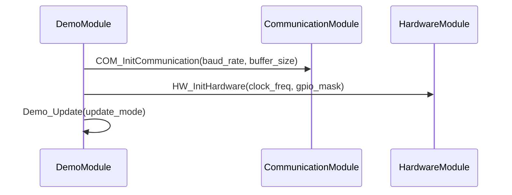
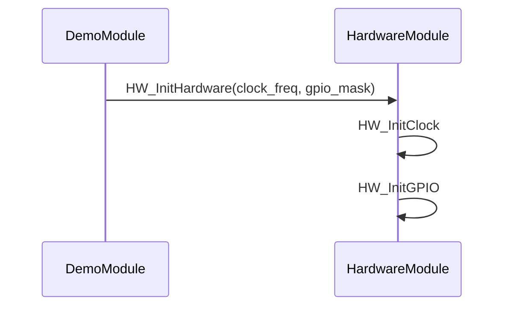
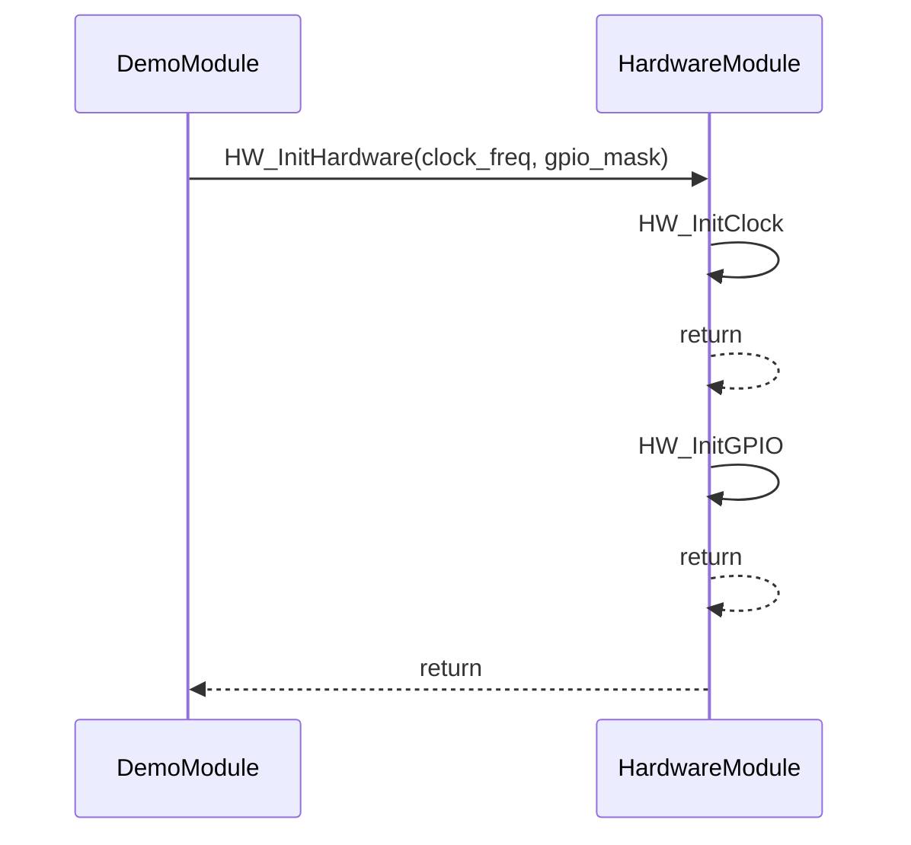
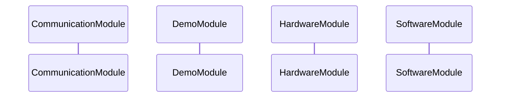
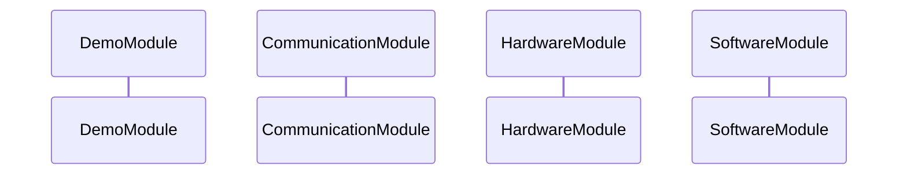

# Parameter Display Requirements

## SWR_PARAMS_00001: Parameter Display in Sequence Diagrams

**Title**: Display function parameters in Mermaid sequence diagram calls

**Maturity**: accept

**Description**:
Function parameters shall be extracted and displayed in the sequence diagram arrows to provide better visibility of data flow between components.

**Rationale**:
Showing parameters in sequence diagrams helps developers understand:
- What data is being passed between functions
- The interfaces and contracts between components
- The flow of information through the system
- Potential data dependencies

**Functional Requirements**:

1. **Parameter Extraction**:
   - The AUTOSAR parser shall extract parameters from function declarations
   - Parameters shall be parsed from both AUTOSAR macros (`VAR`, `P2VAR`, `P2CONST`, `CONST`) and traditional C syntax
   - Parameter names shall be used in the display (not just types)

2. **Parameter Display Format**:
   - Parameters shall be displayed in parentheses after the function name
   - Multiple parameters shall be comma-separated
   - Only parameter names shall be shown (not types) to keep diagrams clean
   - Format: `function_name(param1, param2, param3)`

3. **Empty Parameters**:
   - Functions with no parameters shall display without parentheses
   - `void` parameters shall not be displayed

4. **Recursive Calls**:
   - Recursive calls shall display parameters in the same format
   - The recursive marker shall be appended after parameters: `function_name(params) [recursive]`

5. **Integration with Module Names**:
   - When using module-based participants, parameters shall still be displayed on the arrows
   - Format: `ModuleA->>ModuleB: function_name(params)`

**Implementation Notes**:

- Implemented in `src/autosar_calltree/parsers/autosar_parser.py`
- `parse_function_declaration()` now extracts parameters using `_extract_param_string()`
- `parse_parameters()` parses individual parameters from the parameter string
- Implemented in `src/autosar_calltree/generators/mermaid_generator.py`
- `_format_parameters_for_diagram()` formats parameters for display
- `_generate_sequence_calls()` includes formatted parameters in call labels

**Example Output**:



**Example Function Table**:

| Function | Module | File | Line | Return Type | Parameters |
|----------|--------|------|------|-------------|------------|
| `COM_InitCommunication` | CommunicationModule | communication.c | 24 | `void` | `uint32 baud_rate`<br>`uint16 buffer_size` |
| `HW_InitHardware` | HardwareModule | hardware.c | 30 | `void` | `uint32 clock_freq`<br>`uint32 gpio_mask` |
| `Demo_Update` | DemoModule | demo.c | 34 | `void` | `uint32 update_mode` |

## SWR_PARAMS_00002: Optional Return Statements

**Title**: Make return statements optional in sequence diagrams

**Maturity**: accept

**Description**:
Return statements in sequence diagrams shall be optional and omitted by default to provide cleaner, more concise visualizations.

**Rationale**:
- Return statements add visual clutter, especially in deep call trees
- In many cases, the return flow is obvious from the call structure
- Omitting returns makes diagrams more readable and focused on the call flow
- Users who need return statements can enable them programmatically

**Functional Requirements**:

1. **Default Behavior**:
   - Return statements shall be omitted from sequence diagrams by default
   - This applies to both CLI and Python API usage
   - The default value shall be `include_returns=False`

2. **Configurable via Python API**:
   - The `MermaidGenerator` constructor shall accept an `include_returns` parameter
   - When `include_returns=True`, return statements shall be generated
   - When `include_returns=False`, return statements shall be omitted

3. **Recursive Calls**:
   - Recursive calls shall still use the `-->>x` arrow style regardless of return setting
   - This indicates self-calls even when returns are disabled

4. **CLI Behavior**:
   - The CLI shall use the default (returns omitted)
   - No CLI flag shall be provided to enable returns (Python API only)
   - This keeps the CLI simple and focused on the most common use case

**Implementation Notes**:

- Implemented in `src/autosar_calltree/generators/mermaid_generator.py`
- `__init__()` accepts `include_returns` parameter with default `False`
- `_generate_sequence_calls()` only generates return statements when `self.include_returns` is `True`

**Example Output (Without Returns - Default)**:



**Example Output (With Returns - Python API)**:



## SWR_PARAMS_00003: Participant Order Preservation

**Title**: Preserve participant order in sequence diagrams

**Maturity**: accept

**Description**:
Participants in sequence diagrams shall appear in the order they are first encountered in the call tree, not sorted alphabetically.

**Rationale**:
- Natural call flow order is more intuitive than alphabetical sorting
- Helps readers understand the sequence of interactions
- Matches the order in which components are encountered in the code
- Particularly important when using module-based participants

**Functional Requirements**:

1. **First Encounter Order**:
   - Participants shall be added to the list when first encountered during tree traversal
   - Duplicate participants shall not be added again
   - The final order shall match the order of first appearance

2. **Tree Traversal**:
   - Participants shall be collected during depth-first traversal of the call tree
   - The order shall reflect the call sequence from the root function

3. **No Sorting**:
   - Participants shall NOT be sorted alphabetically or by any other criteria
   - The natural traversal order shall be preserved

**Implementation Notes**:

- Implemented in `src/autosar_calltree/generators/mermaid_generator.py`
- `_collect_participants()` uses a list instead of a set to maintain order
- Participants are added only if not already in the list (preserves first occurrence)

**Example**:

Given this call structure:
```
Demo_Init
├── COM_InitCommunication (CommunicationModule)
├── HW_InitHardware (HardwareModule)
└── SW_InitSoftware (SoftwareModule)
```

**Old Behavior (Sorted Alphabetically)**:


**New Behavior (First Encounter Order)**:
